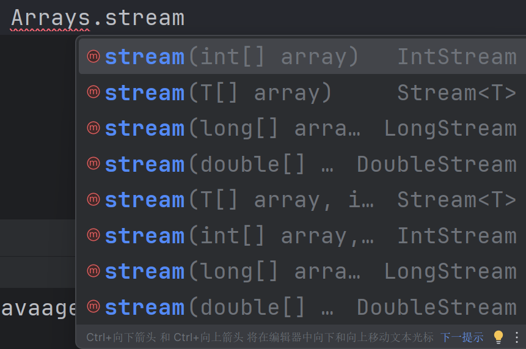

正文

# Stream流

## 什么是流

可以类比工厂的流水线大致过程：

```
以装饮料的流水线为例：

塑料瓶放上流水线
	|
	|
给塑料瓶进行消毒
	|
	|
给塑料瓶进行清洗
	|
	|
饮料装入塑料瓶
	|
	|
为塑料瓶封装上瓶盖
```


## 什么是Stream流

为了更加高效的操作`Collection`集合的相关操作，比如筛选数据


## 获取Stream流

注意：使用stream操作数据不会改变原有的数据


### 单列集合（即`Collection`下的集合，包括Set，List）：

> 由于`Collection`中有`Stream`的默认方法

因此，单列集合直接使用`.stream()`就可以获取Stream流

```java
package Stream_demo1;

import java.util.ArrayList;
import java.util.Collections;
import java.util.List;

public class code1 {
    public static void main(String[] args) {
        List<Integer> lst=new ArrayList<>();

        Collections.addAll(lst,1,2,3,4,5,6);

        // 链式编程，先获取stream流，再使用forEach和lambda表达式进行打印内容
        lst.stream().forEach(integer->System.out.print(integer+"  "));

    }
}

```


### 双列集合（即`Map`接口下的集合）

#### 方法一

**双列集合不能够直接调用stream()，需要先转变成为单列集合才可以**

```java
// 首先我们先创建一个Map集合，并且存放键值对

Map<String,Integer> m=new HashMap<>();
m.put("张三",23);
m.put("李四",32);
m.put("王五",84);
```

我们就可以通过`.keyset()`获取键名的单列集合`Set`，再使用单列集合获取Stream流的方法进行获取

完整如下：

```java
package Stream_demo1;

import java.util.HashMap;
import java.util.Map;

public class code2 {
    public static void main(String[] args) {
        Map<String,Integer> m=new HashMap<>();
        m.put("张三",23);
        m.put("李四",32);
        m.put("王五",84);

        // 先获键的单列集合的Stream流，再打印键值对
        m.keySet().stream().forEach(s -> System.out.print(s+" = "+m.get(s)+"\n"));

    }
}

```

#### 方法二

**双列集合不能够直接调用stream()，我们可以获取键值对**

我们知道Map集合里面的`.entrySet()`方法返回值是`Set<Map.Entry<K,V>>`，是一个单列集合Set，于是我们可以获取这个单列集合的Stream进行打印

代码如下：

```java
package Stream_demo1;

import java.util.HashMap;
import java.util.Map;

public class code2 {
    public static void main(String[] args) {
        Map<String,Integer> m=new HashMap<>();
        m.put("张三",23);
        m.put("李四",32);
        m.put("王五",84);

        m.entrySet().stream().forEach(entries-> System.out.println(entries.getKey()+" = "+entries.getValue()));
    }
}

```


### 数组：

> 数组的工具类`Arrays`里面已经包含了关于`stream流`的静态方法，于是可以直接使用
>
> > 或者，如果数组是**引用数据类型**，那么可以使用`stream接口`中的静态方法`of`
>
> 
>
> **同时，`不管是基本数据类型还是引用数据类型都可以使用`**
>
> 原因：
>
> 
>
> `Arrays`工具类里面关于`stream流`有许多的重载方法，如果数组为引用数据类型则**会调用泛型参数的方法**


#### 基本数据类型

```java
package Stream_demo1;

import java.util.Arrays;

public class code3 {
    public static void main(String[] args) {
        int[] arr={1,2,3,4,5,6,7};
        // 使用Arrays工具类和lambda表达式进行遍历
        Arrays.stream(arr).forEach(i-> System.out.println(i));
    }
}

```


#### 引用数据类型

- student类

```java
package Stream_demo1;

public class student {
    private int age;
    private String name;

    public student(int age,String name)
    {
        this.age=age;
        this.name=name;
    }
    public student(){}


    /**
     * 获取
     * @return age
     */
    public int getAge() {
        return age;
    }

    /**
     * 设置
     * @param age
     */
    public void setAge(int age) {
        this.age = age;
    }

    /**
     * 获取
     * @return name
     */
    public String getName() {
        return name;
    }

    /**
     * 设置
     * @param name
     */
    public void setName(String name) {
        this.name = name;
    }

    public String toString() {
        return "student{age = " + age + ", name = " + name + "}";
    }
}

```

- 测试类

```java
package Stream_demo1;

import java.util.Arrays;

public class code3 {
    public static void main(String[] args) {
        student[] ss=new student[3];
        ss[0]=new student(19,"Mike");
        ss[1]=new student(18,"Amy");
        ss[2]=new student(20,"John");

        Arrays.stream(ss).forEach(s-> System.out.println(s));

    }
}

```


#### 使用静态方法of

```java
package Stream_demo1;

import java.util.stream.Stream;

public class code3 {
    public static void main(String[] args) {
        student[] ss=new student[3];
        ss[0]=new student(19,"Mike");
        ss[1]=new student(18,"Amy");
        ss[2]=new student(20,"John");

        Stream.of(ss).forEach(s-> System.out.println(s));

    }
}

```


> ## 为什么引用数据类型可以使用of
>
> 因为观察静态方法`of`的参数，发现是一个可变参数，而可变参数的底层就是一个数组，于是使用`of`也是可以的
>
> 
>
> ## 为什么基本数据类型不能使用of
>
> - 如果是引用数据类型，Java会将里面的元素获取出来放入stream流中
>
>   这样会打印每一个元素
>
> - 但是如果是基本数据类型，Java就会把这个数组当作一个整体放入stream流中
>
>   这样就只能打印这个数组的地址值了
>
> ```java
> // 代码：
> package Stream_demo1;
> 
> import java.util.stream.Stream;
> 
> public class code3 {
>     public static void main(String[] args) {
>         student[] ss=new student[3];
>         ss[0]=new student(19,"Mike");
>         ss[1]=new student(18,"Amy");
>         ss[2]=new student(20,"John");
>         int[] arr={1,2,3,4,5};
> 
>         Stream.of(arr).forEach(s-> System.out.println(s));
> 
>         //Arrays.stream(ss).forEach(s-> System.out.println(s));
> 
>     }
> }
> 
> ```
>
> 结果：
>
> 
>
> 
>
> 当然也有解决方法，就是定义数组时写对应的包装类，把`int[]`改为`Integer[]`
>
> ```java
> package Stream_demo1;
> 
> import java.util.stream.Stream;
> 
> public class code3 {
>     public static void main(String[] args) {
>         student[] ss=new student[3];
>         ss[0]=new student(19,"Mike");
>         ss[1]=new student(18,"Amy");
>         ss[2]=new student(20,"John");
>         Integer[] arr={1,2,3,4,5};
> 
>         Stream.of(arr).forEach(s-> System.out.println(s));
> 
>         //Arrays.stream(ss).forEach(s-> System.out.println(s));
>     }
> }
> ```
>
> 结果：
>
> 
>
> 


### 零碎数据

对没有放进集合或者数组的数据也可以使用stream流

需要使用`stream接口`中的静态方法`of`

```java
package Stream_demo1;

import java.util.stream.Stream;

public class code4 {
    public static void main(String[] args) {
        Stream.of(1,2,3,4,5).forEach(i-> System.out.println(i));
    }
}

```


## Stream的中间方法

### 过滤方法`filter()`

>### 使用方法
>
>- 获取Stream流
>- 使用`filter()`方法
>- 在`filter()`参数中输入过滤规则

以单列集合举例


可以看到参数是一个叫 `Predicate`的玩意，使用`ctrl+B`查看源代码发现


这是一个函数式接口，于是我们可以采用匿名内部类，Lambda表达式的方法进行书写参数


基本代码为：

```java
package Stream_mid_demo1;

import java.util.ArrayList;
import java.util.Collections;
import java.util.function.Predicate;

public class code {
    public static void main(String[] args) {

        ArrayList<String> arr=new ArrayList<>();
        Collections.addAll(arr,"张三","李四","王五","张太平","李老板","李麻");

        arr.stream().filter(new Predicate<String>() {
            @Override
            public boolean test(String s) {
                return false;
            }
        })
    }
}
```


其中

```java
arr.stream().filter(new Predicate<String>() {
    @Override
    public boolean test(String s) {
        return false;
    }
})
```

这一块就是接口中的规则，其中`s`表示在流中的每一个元素，方法需要返回`true`或者`false`，其中如果返回`true`就表示需要将这个元素过滤

当我们想要实现**将所有姓氏为“张”的元素过滤出来**就可以在接口方法里书写如下规则

```java
@Override
public boolean test(String s) {
    // 表示s的开头为“张”
    // .startsWith方法返回的是boolean，所以不写if判断也可以
    if (s.startsWith("张"))
    {
        return true;
    }
    else
    {
        return false;
    }
}
```


完整代码为：

```java
package Stream_mid_demo1;

import java.util.ArrayList;
import java.util.Collections;
import java.util.function.Predicate;

public class code {
    public static void main(String[] args) {
        ArrayList<String> arr=new ArrayList<>();
        Collections.addAll(arr,"张三","李四","王五","张太平","李老板","李麻");
        arr.stream().filter(new Predicate<String>() {
            @Override
            public boolean test(String s) {
                if (s.startsWith("张"))
                {
                    return true;
                }
                else
                {
                    return false;
                }
            }
        }).forEach(item-> System.out.println(item));
    }
}


// 运行结果为：  张三    张太平
```


但是单单使用匿名内部类的方式太长了，于是我们可以使用lambda表达式和三目运算符进行简化

```java
package Stream_mid_demo1;

import java.util.ArrayList;
import java.util.Collections;
import java.util.function.Predicate;

public class code {
    public static void main(String[] args) {
        ArrayList<String> arr=new ArrayList<>();
        Collections.addAll(arr,"张三","李四","王五","张太平","李老板","李麻");
        arr.stream().filter(s->s.startsWith("张")).forEach(item-> System.out.println(item));
    }
}

```


同时我们还可以采取链式编程的方式，不断地叠加过滤条件

***为了看起来更加舒适可以采取分行的写法***

```java
// 筛选开头为张，并且长度为3的元素
package Stream_mid_demo1;

import java.util.ArrayList;
import java.util.Collections;
import java.util.function.Predicate;

public class code {
    public static void main(String[] args) {
        ArrayList<String> arr=new ArrayList<>();

        Collections.addAll(arr,"张三","李四","王五","张太平","李老板","李麻");
        
        
        arr.stream()
                .filter(s->s.startsWith("张"))
                .filter(s->s.length()==3)
                .forEach(item-> System.out.println(item));
    }
}

```


### 获取前n个元素，limit()方法


> ### 使用方法
>
> - 获取stream流
> - 使用`limit()`方法进行获取流中的前n个元素
> - 使用`forEach()`进行读取


以单列集合举例


方法的参数是一个`long`型的数，表示前几个元素


**获取前3个元素**     完整代码 ：

```java
package Stream_mid_demo1;

import java.util.ArrayList;
import java.util.Collections;

public class code2 {
    public static void main(String[] args) {
        ArrayList<String> arr=new ArrayList<>();

        Collections.addAll(arr,"张三","李四","王五","张太平","李老板","李麻");
        arr.stream()
                .limit(3)
                .forEach(item-> System.out.println(item));
    }
}

// 结果： 张三   李四   王五
```

输出结果就是前3个元素的值


### 跳过前n个元素    skip()方法


> 使用方法：
>
> - 获取stream流
> - 使用`skip()`方法跳过前n个元素
> - 使用`forEach`读取


`skip()`方法的参数和`limit()`方法一样，都是一个`long`型的数，表示几个元素


**跳过前3个元素**    完整代码：

```java
package Stream_mid_demo1;

import java.util.ArrayList;
import java.util.Collections;

public class code3 {
    public static void main(String[] args) {
        ArrayList<String> arr=new ArrayList<>();

        Collections.addAll(arr,"张三","李四","王五","张太平","李老板","李麻");
        arr.stream()
                .skip(3)
                .forEach(item-> System.out.println(item));
    }
}

// 结果为：  张太平   李老板   李麻

```


### 一个小细节

> 为什么一直都是像`.stream().filter().filter()`这样连着写的？


我们还是拿单列集合举例，你要问我为什么一直用单列集合？因为它方便:clown_face:


我们如果不采用链式编程，按照如下操作进行


> - 先获取`stream`流，保存在变量`stream1`中
> - 调用`stream1`的`filter()`方法，对“张”开头的名字进行过滤，将这个新的流保存为变量`stream2`中
> - 对`stream2`进行调用`forEach`进行遍历


代码如下：

```java
package Stream_mid_demo1;

import java.util.ArrayList;
import java.util.Collections;
import java.util.stream.Stream;

public class code4 {
    public static void main(String[] args) {
        ArrayList<String> arr=new ArrayList<>();

        Collections.addAll(arr,"张三","李四","王五","张太平","李老板","李麻");

        Stream<String> stream1 = arr.stream();
        Stream<String> stream2 = stream1.filter(s -> s.startsWith("张"));
        stream2.forEach(item-> System.out.println(item));
    }
}

// 运行结果： 张三   张太平

```


我们发现运行结果没有毛病！！！

但是当我心血来潮，想去再遍历一下`stream1`这个流，看看初始的里面有什么

```java
package Stream_mid_demo1;

import java.util.ArrayList;
import java.util.Collections;
import java.util.stream.Stream;

public class code4 {
    public static void main(String[] args) {
        ArrayList<String> arr=new ArrayList<>();

        Collections.addAll(arr,"张三","李四","王五","张太平","李老板","李麻");

        Stream<String> stream1 = arr.stream();
        Stream<String> stream2 = stream1.filter(s -> s.startsWith("张"));
        stream2.forEach(item-> System.out.println(item));

		// 让我瞅瞅stream1里面有什么！！！！！
        stream1.forEach(item-> System.out.println(item));
    }
}

```


然后就报错：


原因是stream流设计成只能被使用1次！！为啥这样设计我还不清楚:clown_face:


### 去重方法distinct()

> 使用方法：
>
> - 获取stream流
> - 使用`distinct()`方法去除相同元素
>
> <p style="color: deepskyblue; font-family: 'Arial', sans-serif; text-align: center; font-weight: bold; border: 1px solid deepskyblue; padding: 10px; display: inline-block; background-color: #f9f9f9;">
>     注意，这个方法底层去除相同元素使用的是<span style="color: white; background-color: red;">HashSet</span>，因此对于引用数据类型，需要重写<code>hashCode()</code>和<code>equals()</code>方法
> </p>
>
> 源代码部分：
>
> 
>
> 


使用代码：

```java
package stream_demo1;

import java.util.ArrayList;
import java.util.Collections;

public class distinct_demo {
    public static void main(String[] args) {
        ArrayList<String> arr=new ArrayList<>();
        Collections.addAll(arr,"张三","李四","王五","张太平","李老板","李老板","李老板","李麻");

        arr.stream()
                .distinct()
                .forEach(i-> System.out.println(i));
    }
}

//结果为：张三   李四   王五   张太平   李老板   李麻
```


### 合并两个stream流  concat()

> 使用方法：
>
> - `concat()`方法是Stream接口的静态方法，直接就可以调用
>
> <p style="color: deepskyblue; font-family: 'Arial', sans-serif; text-align: center; font-weight: bold; border: 1px solid deepskyblue; padding: 10px; display: inline-block; background-color: #f9f9f9;">
>     注意，这个方法最好传递两个类型相同的Stream流
> </p>
>
> 如果传递了两个类型不匹配的Stream流，可能会让后续的过滤方法或者map方法报错
>
> 因为当两个类型不匹配的进行合并，会在内部将其都提升为公共的父类`Object`，于是就不能够使用子类的特有方法了


```java
package stream_demo1;

import java.io.Serializable;
import java.util.ArrayList;
import java.util.Collections;
import java.util.function.Function;
import java.util.stream.Stream;

public class concat_demo {
    public static void main(String[] args) {
        ArrayList<String> arr1=new ArrayList<>();
        Collections.addAll(arr1,"张三","李四","王五","张太平","李老板","李麻");

        ArrayList<String> arr2=new ArrayList<>();
        Collections.addAll(arr2,"光头强","能大","能二");

        ArrayList<Integer> arr3=new ArrayList<>();
        Collections.addAll(arr3,1,2,3);

        Stream.concat(arr1.stream(),arr2.stream())
                .forEach(i-> System.out.println(i));

    }
}

// 结果： 张三  李四  王五  张太平  李老板  李麻  光头强  能大  能二


```


### 转换流中的数据类型map()

> 使用方法：
>
> - 获取stream流
> - 使用`.map()`方法
> - 重写方法
>


假如我的数据为：`"光头强-32","能大-10","能二-9","李老板-41"`

现在我需要提取出他们的年龄，但是由于是字符串，我需要转化成整数类型，于是可以使用map实现


```java
package stream_demo1;

import java.util.ArrayList;
import java.util.Collections;
import java.util.function.Function;

public class map_demo {
    public static void main(String[] args) {
        ArrayList<String> arr1=new ArrayList<>();
        Collections.addAll(arr1,"光头强-32","能大-10","能二-9","李老板-41");

        arr1.stream()
            // map的参数是一个接口的实现类对象
            
            	// String表示当前需要转化的类型
            	// Integer表示转化后的类型
                .map(new Function<String, Integer>() {
				
                    @Override
                    
                    // s表示stream流里面的每一个元素
                    public Integer apply(String s) {
                        
                        // 将字符串按照"-"分割成数组类型
                        String[] ss=s.split("-");
                        // 转化为int类型
                        int age=Integer.parseInt(ss[1]);
                        return age;
                    }
                })
                .forEach(i-> System.out.println(i));

    }
}

// 结果为：32   10   9   41

```

或者使用lambda表达式简写

```java
package stream_demo1;

import java.util.ArrayList;
import java.util.Collections;
import java.util.function.Function;

public class map_demo {
    public static void main(String[] args) {
        ArrayList<String> arr1=new ArrayList<>();
        Collections.addAll(arr1,"光头强-32","能大-10","能二-9","李老板-41");

        arr1.stream()
                .map(s->Integer.parseInt(s.split("-")[1]))
                .forEach(i-> System.out.println(i));

    }
}

```


## 终结方法

### toArray()


当调用时有两个方法，首先第一个返回Object类型的数组

可以进行打印

```java
package stream_stop_demo1;

import java.util.ArrayList;
import java.util.Arrays;
import java.util.Collections;

public class code1 {
    public static void main(String[] args) {
        ArrayList<String> arr=new ArrayList<>();
        Collections.addAll(arr,"张三","李四","王五","张太平","李老板","李老板","李老板","李麻");
        Object[] array1 = arr.stream().toArray();
        System.out.println(Arrays.toString(array1));

    }
}

// 结果为：[张三, 李四, 王五, 张太平, 李老板, 李老板, 李老板, 李麻]
```


如果需要指定返回类型，就要使用第二个方法：

参数是一个接口的实例化对象


`<? extends Object[]>`根据之前泛型的知识，这个就是代表接收一个继承Object数组类型的，于是代表任意类型

如果想要返回值类型为String[]就需要把此处改为String[]，下面也要改

形参`value`表示传入的长度，返回值为需要的数组类型的对象

```java
package stream_stop_demo1;

import java.util.ArrayList;
import java.util.Arrays;
import java.util.Collections;
import java.util.function.IntFunction;

public class code1 {
    public static void main(String[] args) {
        ArrayList<String> arr=new ArrayList<>();
        Collections.addAll(arr,"张三","李四","王五","张太平","李老板","李老板","李老板","李麻");
        String[] array = arr.stream().toArray(new IntFunction<String[]>() {
            @Override
            public String[] apply(int value) {
                return new String[value];
            }
        });

        System.out.println(Arrays.toString(array));

    }
}
// 结果为：[张三, 李四, 王五, 张太平, 李老板, 李老板, 李老板, 李麻]
```


该`toArray`方法的底层就会自动依次获取流里的每个元素最后返回


也可以写成lambda的形式

```java
package stream_stop_demo1;

import java.util.ArrayList;
import java.util.Arrays;
import java.util.Collections;
import java.util.function.IntFunction;

public class code1 {
    public static void main(String[] args) {
        ArrayList<String> arr=new ArrayList<>();
        Collections.addAll(arr,"张三","李四","王五","张太平","李老板","李老板","李老板","李麻");
        String[] array = arr.stream().toArray(value->new String[value]);

        System.out.println(Arrays.toString(array));

    }
}
// 结果同上
```


### 收集操作collect


#### 收集到List集合toList()

获取stream流，然后使用`.collect(Collectors.toList())`进行调用

```java
package stream_collect_demo1;

import java.util.ArrayList;
import java.util.Collections;
import java.util.List;
import java.util.function.Predicate;
import java.util.stream.Collectors;

public class code1 {
    public static void main(String[] args) {
        ArrayList<String> arr=new ArrayList<>();
        Collections.addAll(arr,"光头强-男-45","能大-男-12","能二-男-11","翠花-女-10");


        List<String> lst= arr.stream().filter(s -> s.split("-")[1].equals("男"))
                .collect(Collectors.toList());

        System.out.println(lst);


    }
}

```


#### 收集到Set集合toSet()

同上


#### 收集到Map集合toMap()

当我想要把流里面的一些东西拿出来作为键值对，就需要使用`toMap`方法

- 基本框架

```java
package stream_collect_toMap_demo1;

import java.util.ArrayList;
import java.util.Collections;
import java.util.function.Function;
import java.util.stream.Collectors;

public class code {
    public static void main(String[] args) {
        ArrayList<String> arr=new ArrayList<>();
        Collections.addAll(arr,"光头强-男-45","能大-男-12","能二-男-11","翠花-女-10");

        arr.stream()
                .filter(s -> "男".equals(s.split("-")[1]))
                .collect(Collectors.toMap())

    }
}

```


获取stream流，然后使用`.collect(Collectors.toMap())`进行调用


`toMap`有两个参数，都是函数式接口

`keyMapper`代表键的规则

`valueMapper`代表值的规则


现在我的需求是：

> 过滤获取所有性别为男的信息
>
> 将这些信息的名字作为键（String），年龄作为值（Integer）


过滤操作略


先来new一个键规则的对象


其中接口的第一个参数`String`代表流中元素的类型，`Object`表示输出的键的类型，为了获取的键的类型为`String`，于是将`Object`改为`String`


接下来填入第二个参数---值的规则

也是new一个接口的匿名内部类和前面以逗号分割


接口的参数意义同上，为了让输出的值的类型为`int`类型的，因此需要改为`Integer`

```java
package stream_collect_toMap_demo1;

import java.util.ArrayList;
import java.util.Collections;
import java.util.function.Function;
import java.util.stream.Collectors;

public class code {
    public static void main(String[] args) {
        ArrayList<String> arr=new ArrayList<>();
        Collections.addAll(arr,"光头强-男-45","能大-男-12","能二-男-11","翠花-女-10");

        arr.stream()
                .filter(s -> "男".equals(s.split("-")[1]))
                .collect(Collectors.toMap(new Function<String, String>() {
                                              @Override
                                              public String apply(String s) {
                                                  return null;
                                              }
                                          },
                        new Function<String, Integer>() {
                            @Override
                            public Integer apply(String s) {
                                return null;
                            }
                        }));

    }
}

```


这时就可以按照需求写键值规则的对应代码了，其中`apply`的参数`s`表示流中的每一个元素

如下：

```java
.collect(Collectors.toMap(new Function<String, String>() {
                                              @Override
                                              public String apply(String s) {
                                                  return s.split("-")[0];
                                              }
                                          },
                        new Function<String, Integer>() {
                            @Override
                            public Integer apply(String s) {
                                return Integer.parseInt(s.split("-")[2]);
                            }
                        }));
```


在`.collect`处`ctrl+alt+v`自动生成左侧变量，并且打印

```java
package stream_collect_toMap_demo1;

import java.util.ArrayList;
import java.util.Collections;
import java.util.Map;
import java.util.function.Function;
import java.util.stream.Collectors;

public class code {
    public static void main(String[] args) {
        ArrayList<String> arr=new ArrayList<>();
        Collections.addAll(arr,"光头强-男-45","能大-男-12","能二-男-11","翠花-女-10");

        Map<String, Integer> map = arr.stream()
                .filter(s -> "男".equals(s.split("-")[1]))
                .collect(Collectors.toMap(new Function<String, String>() {
                                              @Override
                                              public String apply(String s) {
                                                  return s.split("-")[0];
                                              }
                                          },
                        new Function<String, Integer>() {
                            @Override
                            public Integer apply(String s) {
                                return Integer.parseInt(s.split("-")[2]);
                            }
                        }));
        
        System.out.println(map);

    }
}


// 结果为：{能二=11, 光头强=45, 能大=12}
```


由于都是函数式接口，因此可以简写为Lambda表达式

```java
package stream_collect_toMap_demo1;

import java.util.ArrayList;
import java.util.Collections;
import java.util.Map;
import java.util.function.Function;
import java.util.stream.Collectors;

public class code {
    public static void main(String[] args) {
        ArrayList<String> arr=new ArrayList<>();
        Collections.addAll(arr,"光头强-男-45","能大-男-12","能二-男-11","翠花-女-10");

        Map<String, Integer> map = arr.stream()
                .filter(s -> "男".equals(s.split("-")[1]))
                .collect(
                        Collectors.toMap(
                                s->s.split("-")[0],
                        s->Integer.parseInt(s.split("-")[2])));

        System.out.println(map);

    }
}

```


##### 注意：

`toMap`操作的元素的键不能够相同，原因是底层源码是这样设计的


